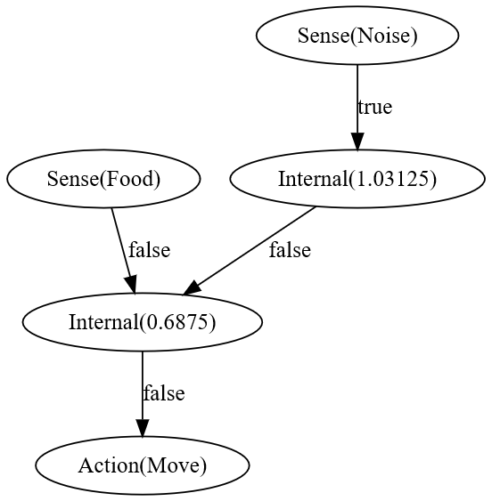

# Simulating Emergent Behavior

I've found plenty of fantastic genetic algorithm implementations out there (see: [Life Engine](https://thelifeengine.net/) and [this video](https://youtu.be/N3tRFayqVtk) by David Miller). There's a number of markedly different approaches, each with their own strengths and weaknesses. Some represent creatures as a series of cells, while others keep the creature simple while instead evolving their behavior. This is my take on the latter. The goal is to take a string of numbers (the creature's *genome*) and turn it into a series of interconnected neurons that dictate the organism's behavior based on external stimuli (more about gene coding [here](#genes). Then, over many generations, mutations in the genome will lead to creatures that interact in a quasi-intelligent manner.

For example, from the following genome...  
```
10000001 11000100 00000100 10000000 01010110 10101110 01100001
00000001 00100000 11010010 10000010 10000010 10011111
```

We can construct a creature with a 'brain' that looks like this:

<kbd></kbd>

Some assumptions can be made about this creature's behavior (it appears to dislike noise and move towards food), but the logic behind its choices becomes obfuscated as the size of its brain increases.

## Evolution

The simulation runs generation by generation according to a simple set of [rules](#simulation-rules). At the end of each generation, the 'fitness' of each creature is assessed, and the most successful organisms produce offspring. However, these offspring are not just copies of their parent. Mutations occur frequently, and over the course of generations, better and better survival tactics emerge (in theory).

***

#### Genes

Genes code for neurons and the connections between them.  
Here's how nodes are processed:
```
0 0 X X X X X X
│ │ └──┬────┘
│ │    type of nueron
│ sense/action
if 1, represents an internal node
(remaining bits encode the node's bias)
``` 

Connections work a little differently.
It takes two genes to encode a connection.  
The first is the input node's index, the second is the output's.
```
1 X X X X X X X
│ └───┬─────┘
│     node index
inhibitory/additive connection
``` 

Inhibitory connections weaken their output node's signal, additive strengthens it.

#### Simulation Rules

1. Every turn, each creature takes an action. The most fit creatures act first
2. Fitness determines number of offspring
3. Offspring have a chance to undergo mutations between generations
4. Creatures cannot move through walls
5. When a creature is killed, it becomes food
6. Creatures that failed to eat food in the previous generation do not reproduce

That's it