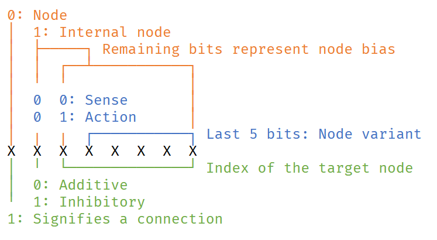

# Simulating Emergent Behavior

I've found plenty of fantastic genetic algorithm implementations out there (see: [Life Engine](https://thelifeengine.net/) and [this video](https://youtu.be/N3tRFayqVtk) by David Miller). There's a number of markedly different approaches, each with their own strengths and weaknesses. Some represent creatures as a series of cells, while others keep the creature simple while instead evolving their behavior. This is my take on the latter. The goal is to take a string of numbers (the creature's *genome*) and turn it into a series of interconnected neurons that dictate the organism's behavior based on external stimuli (more about gene coding [here](#genes). Then, over many generations, mutations in the genome will lead to creatures that interact in a quasi-intelligent manner.

For example, from the following genome...  
```
10000001 11000100 00000100 10000000 01010110 10101110 01100001
00000001 00100000 11010010 10000010 10000010 10011111
```

We can construct a creature with a 'brain' that looks like this:

<kbd></kbd>

Some assumptions can be made about this creature's behavior (it appears to dislike noise and move towards food), but the logic behind its choices becomes obfuscated as the size of its brain increases.

## Evolution

The simulation runs generation by generation according to a simple set of [rules](#simulation-rules). At the end of each generation, the 'fitness' of each creature is assessed, and the most successful organisms produce offspring. However, these offspring are not just copies of their parent. Mutations occur frequently, and over the course of generations, better and better survival tactics emerge (in theory).

***

#### Creatures

Creatures have 2 principal attributes that effect their reproduction and death cycles.

*Nutrition:* 
Refills after eating. 
Consumed gradually by actions. 
When no nutrition remains, the creature is starving, and has a chance to die. 
This chance is proportional to the creature's fitness...

*Fitness:* 
Increases through eating or producing food. 
Affects chance of reproduction. 
Fitness is reset after a creature reproduces.

#### Simulation Rules

The simulation space is a 2D grid of cells, each of which can contain either an agent, food, or a wall.

1. Creatures cannot move through walls
2. Food diffuses to adjacent space over time (resembles the [Abelian sandpile model](https://en.wikipedia.org/wiki/Abelian_sandpile_model))
3. Food gradually decays over time
4. Every turn, each creature takes an action
5. Creatures with the highest fitness act first
6. Offspring undergo mutations, differentiating them from their parent
7. When a creature dies, it becomes food, proportional to its fitness

#### Genes

Genes code for neurons and the connections between them.  
Each gene is an 8-bit integer; the individual bits define the gene's role in the creation of its creature's brain.

<kbd></kbd>

It takes two genes to define a connection.
The first encodes the input node's index, the second points to the connection's target.
Inhibitory connections weaken their output node's signal, additive strengthens it.
